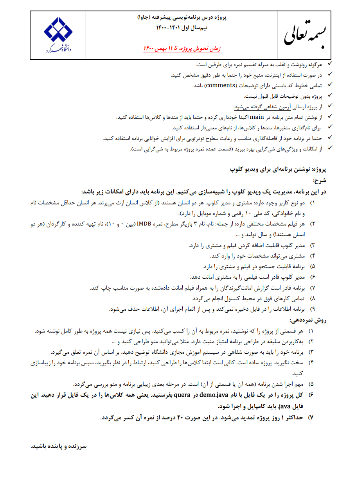
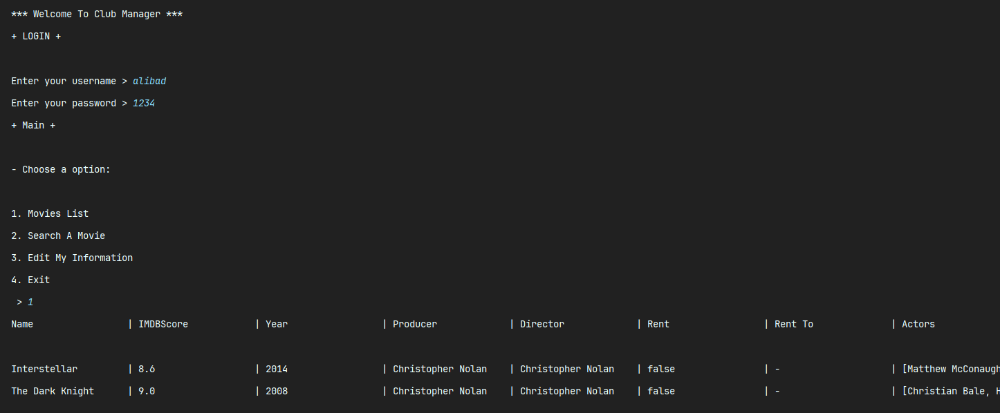

# **📹 Video Club Management Project | پروژه مدیریت ویدیو کلوپ**

**A university project in which a video club management system is designed.**

**یک پروژه دانشگاهی که در آن یک سیستم مدیریت ویدیو کلوپ طراحی می‌شود.**

# 💬 **نکات پروژه**

* عکس‌های برنامه در دایرکتوری ScreenShots قرار دارند.
* برای اجرا برنامه، به JDK 16 و یا بالاتر نیاز دارید.
* پروژه اصلی در دایرکتوری MahdiProject نگه داری میشود. ۵ پروژه‌ی دیگر محتوای یکسان دارند ولی با روش‌های مختلفی پیاده‌سازی شده‌اند و ظاهر متفاوتی نیز دارند.
* برای دسترسی به همه‌ی پروژه‌های دانشگاهی من، به این لینک مراجعه کنید:

👈🏻 **[پروژه‌های دانشگاهی من](https://github.com/bestmahdi2/Uni__Bachelors_SKU_Path)**

# 📝 **توضیحات پروژه**

# 🖼 **عکس‌های پروژه**

   

